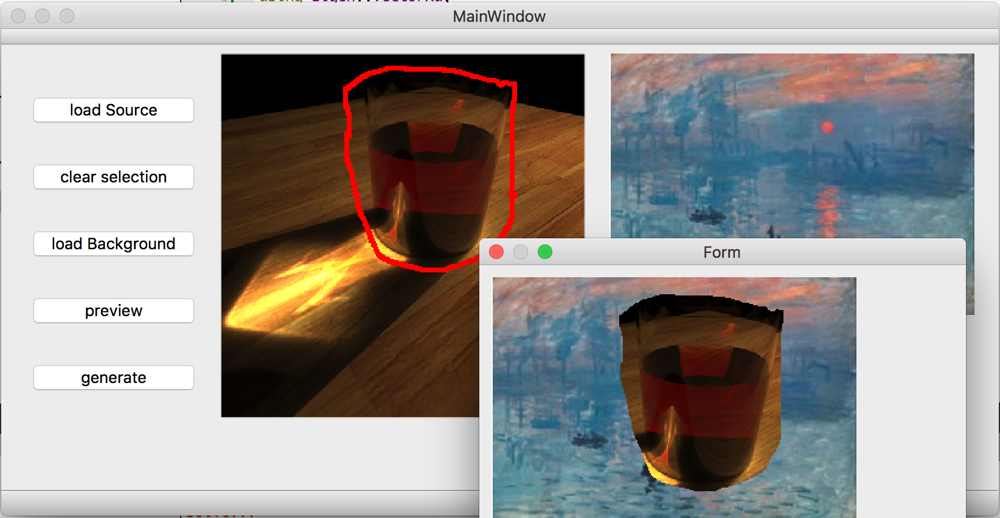
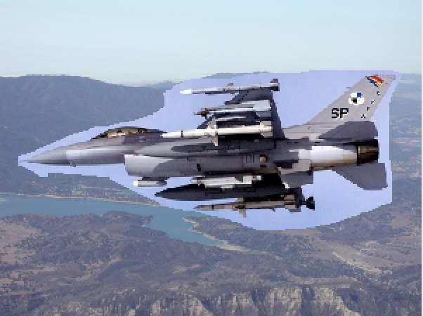
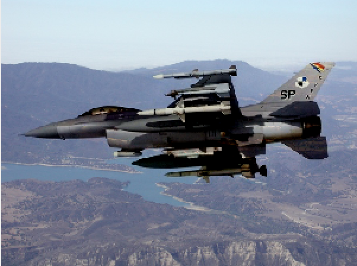

# Poisson Image Editing
## 实验目的
将两张图片的不同部分拼合在一起是常见的图像编辑任务，比如照相馆中经常会将前景的人相增加背景。传统方法是通过人工的抠图将前景中的主体部分，与背景拼合，最后做边缘羽化。但是即使如此边缘仍然很突兀。

本文提到的方法目的就是做到两部分的无缝衔接，效果十分惊艳。

## 方法介绍
算法的思想首先是将无缝衔接进行数学建模，很自然地想到边界出像素应该变化不太剧烈地，而作者更进一步地想到这个变化应该比较“自然”，即跟前景图或者背景图在边界的变化率类似。

因此如果我们用一个向量场$$\vec{\ v}$$表示我们想要的梯度，目标就变成了确定前景区域的每个像素$$f$$，最优化下面这个式子：
$$\min\limits_f\sum\limits_{<p,q>\cap\Omega}(f_p-f_q-v_{qp})^2,with \ f_p=f^*_p,for \ all \ p \in \partial \Omega $$
其实$$\Omega$$为中间的前景区域，$$\partial \Omega$$为边界区域（属于背景但是有邻居属于前景区域）。

那么解决这个二次优化问题可以通过对于每个变量求偏导数，得到泊松方程然后直接求解即可。由于变量较多，可以用数值算法，如高斯赛德尔迭代法等。

## 具体实现
具体实现使用了C++语言编写，GUI部分使用了QT框架，数值求解使用了高效快速的Eigen库。

运行步骤：
1.`git submodule update --init --recursive`
2.确保电脑上安装QT后执行`qmake`和`make`，生成目标程序。

GUI如下图所示（右下为直接拼合预览）：

1.通过load Source和load Background的按钮可以加载图片，图片为了显示方便被缩放到固定宽度。
2.在前景图上按住鼠标左键可以圈选图像，框选可以有多个部分，但是每个部分必须封闭，最后通过左上角点进行广度优先搜索确定圈选部分。如果画得不好可以点击clear selection重新绘制。
3.点击preview会弹出新窗口展示直接拼合结果，可以检查圈选是否有问题。
4.点击generate会运行算法，弹出最后的无缝拼合图像。

算法部分按照论文中做法，将论文中提到的高斯赛德尔迭代法换成了更加稳定的“稳定双共轭梯度法”。同时选择了论文中的Mixing gradients构建向量场的方法，使得内部纹理更接近背景，大部分情况下效果更好。

## 实验效果
以网上找到的飞机-天空图片为例（并未参照任何人代码）。
直接拼合：

泊松图像编辑：

## 总结
1.深刻感受到数学建模的重要，将无缝衔接转换到期望梯度场，又与泊松方程结合起来，需要深厚的建模功底。
2.感觉在媒体计算的经典论文中多次用到了凸优化问题，特别是直接对每个点进行建模，取得了很好的效果。这个方法可能会成为我今后解决问题优先考虑的一个方法。
3.站在巨人的肩膀上。使用Eigen库的算法比自己实现的无论从可用性扩展性还是速度方面都好不少。

感谢助教老师的指导。